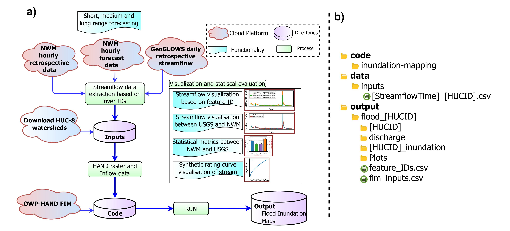

# Flood Inundation Mapping Tool using the OWP HAND-FIM operational framework
<hr style="border: 1px solid black; margin: 0;">  

[](https://github.com/sdmlua/FIMserv/releases)
[](https://github.com/sdmlua/FIMserv/issues)
[](https://opensource.org/licenses/GPL-3.0)
[](https://hits.seeyoufarm.com)
[](https://badge.fury.io/py/fimserve)
[](https://pepy.tech/projects/fimserve)


### **OWP HAND-FIM 'as a service' (FIMserv)**
<hr style="border: 1px solid black; margin: 0;">  

| | |
| --- | --- |
| <a href="https://sdml.ua.edu"></a> | This package presents a streamlined, user-friendly and cloud-enabled pipeline to generate Operational flood inundation map using the NOAA Office of Water Prediction (OWP) Height Above Nearest Drainage (HAND) Flood Inundation MApping (FIM) framework using the National Water Model retrospective and forecasted streamflow. It is developed under the Surface Dynamics Modeling Lab (SDML) as part of a project funded by the Cooperative Institute for Research to Operations in Hydrology (CIROH). |


### **Background**
<hr style="border: 1px solid black; margin: 0;">  

OWP HAND-FIM is a national-scale operational flood forecasting framework (https://github.com/NOAA-OWP/inundation-mapping). It is a terrain-based fluvial flooding model that uses model-predicted streamflow and reach-averaged Synthetic Rating Curves (SRCs) to generate inundation extent and depth rasters at HUC-8 scale (Hydrologic Unit Code-8). The model can produce FIMs for all order streams within the watershed at a very low computational cost. This notebook streamline the FIM generation process or the OWP HAND-FIM framework on the cloud. It allow users to run over mutiple HUC-8s simultaneously. This model can run using any temporal resolution available from the input streamflow data (hourly, daily, monthly etc). 

### **Package structures**
<hr style="border: 1px solid black; margin: 0;">  

This FIMserv framework is published as python package and published on [PyPI](https://pypi.org/project/fimserve/0.1.62/) [](https://badge.fury.io/py/fimserve). It contains multiple modules to perform different functionalities which are structured into the fimserve folder while development of python packaging.
```bash
FIMserv/
├── docs/                   # Documentation (contains 'FIMserv' Tool usage sample codes)
├── GeoGLOWS/               # Streamflow download using GeoGLOWS hydrofabrics
├── src/
│   └── fimserve/         
│       ├── streamflowdata/ # Handles streamflow data
│       │   ├── nwmretrospectivedata.py   # Processes NWM retrospective data
│       │   └── forecasteddata.py        # Processes all range forecasted streamflow data
│       ├── plots/          # Vizualization functionalities
│       ├── FIMsubset/      # Subsetting functionalities for FIM
│       │   ├── xycoord.py  # Subset using Lat, Lon 
│       │   └── shpsubset.py # Subset using boundary
│       ├── statistics/     # Statistical analysis
│       │   └── calculatestatistics.py  # Statistical analysis between NWM and USGS gauge data
│       ├── datadownload.py # Includes HUC8 data retrival and folder management module
│       ├── runFIM.py       # OWPHAND model execution
│       ├── vizualization.py # Interactive visualization of user-defined inundation files (in Jupyter Notebook)
└── tests/                  # Includes test cases for different functionality

```
**The structure of the framework consisting its applications and connection between different functionalities.** The right figure, **b)**, is the directory structure used in this package (for e.g. after using this code by following [docs/code_usage.ipynb](./docs/code_usage.ipynb)) to download and process one or multiple hucs. 



<em>Fig. (a)A complete workflow demonstrating the framework architecture, and (b) directory structure as it appears on the user's system after using the FIMserv for FIM generation.</em>
### **Tool Usage**
<hr style="border: 1px solid black; margin: 0;">  

Although not mandatory, 
**we strongly recommend users create a virtual environment and install this package on that virtual environment to avoid the conflict between system dependencies and package dependencies.**
```bash
#creating a virtual environment using conda
conda create --name fimserve python==3.10

#Activate environment
conda activate fimserve
```
**Install or add fimserve into your workflows**
```bash
#Using pip
pip install fimserve

#OR add using poetry to your framework development for quick FIM generation
poetry add fimserve
```

**FIM generation only in 3 steps using fimserve framework**

This framework have multiple other funtionalities, but the most important is to generate the FIM. The following step is the standard way to generate FIM using OWP Operation FIM framework with FIMserv. This is just a quick 3 steps for one huc and one event, user can use this framework as many case and event as per thier requirement. The google colab version of **FIMin3Steps is here**- [](https://colab.research.google.com/drive/1LLagzuLKTDu3WzwjqRoIgnn2iiAveU2f?usp=sharing) 

```bash
#Import framework once it is installed in your workflows
import fimserve as fm

# Initialize necessary variables
huc = "03020202"        #HUC8 ID
start_date = "2016-10-08"   #Start date of the streamflow data
end_date = "2016-10-10"     #End date of the streamflow data

value_time = ["2016-10-09 03:00:00"]   #Time of the streamflow data user want to generate FIM within start_date and end_date
```
**Step 1. Download HUC8 data**

OWP HAND FIM model runs at HUC-8 watershed scale. User need to identify the HUC8 ID for their specific region of interest. In this example we are using the Neuse River Flooding in North Carolina from Hurricane Mathhew,2016. The HUC8 id is 03020202. The locations and informations about the HUC8 IDs are available here in: **<a href="https://ualabama.maps.arcgis.com/apps/instant/basic/index.html?appid=88789b151b50430d8e840d573225b36b" target="_blank">ArcGIS Instant App</a>**.

```bash
fm.DownloadHUC8(huc)    #Download the HUC8 data
```
**Step 2. Get the NWM Streamflow data**

Users can retrieve NWM forecasted and retrospective data for a specified date range (start date to end date). Additionally, they can store streamflow data for a specific date, as defined by value_times, during the initialization process to generate FIM.
```bash
fm.getNWMretrospectivedata(start_date, end_date, huc, value_time)
```
**Step 3. Generate the Flood Inundation Mapping**

This functionality automatically uses the recently downloaded and stored streamflow to generate FIM. This automation is based on the HUCID.

```bash
fm.runOWPHANDFIM(huc)       #Run the OWP-HAND FIM with the NWM retrospective streamflow data
```

Then there are a lot of different modules/funtionalities related to Syntetic Rating Curve (SRCs) analysis, NWM and USGS streamflow Evaluation, Subsetting of FIM, Domain filtering etc. For reference to run, [Here (docs/code_usage.ipynb)](./docs/code_usage.ipynb) is the sample usage of this FIMserv tool and which covers all modules in detailed and to generate FIM only, follow this shorter, FIM in 3 steps version [Here (docs/FIMin3steps.ipynb)](./docs/FIMin3steps.ipynb). 

Use Google Colab. Here is **Detailed code Usage of FIMserv in Google Colab**: [](https://colab.research.google.com/drive/1mAjgkkCvR3Tcbdz48SwlkHmEo1GZvsh7?usp=sharing)


**Different HUC8 IDs, USGS gauge stations and flowline information that might be required to further understand/running this framework can be found in this <a href="https://ualabama.maps.arcgis.com/apps/instant/basic/index.html?appid=88789b151b50430d8e840d573225b36b" target="_blank">ArcGIS Instant App</a>.** 

 
### **Acknowledgements**
<hr style="border: 1px solid black; margin: 0;">  

| | |
| --- | --- |
|  | Funding for this project was provided by the National Oceanic & Atmospheric Administration (NOAA), awarded to the Cooperative Institute for Research to Operations in Hydrology (CIROH) through the NOAA Cooperative Agreement with The University of Alabama (#Funding ID). |
| | We would like to acknowledge the TEEHR script developed by RTI International (https://github.com/RTIInternational/teehr). We use this script to get NWM discharge quickly.|

### **For More Information**
<hr style="border: 1px solid black; margin: 0;">  

#### **Contact**

<a href="https://geography.ua.edu/people/sagy-cohen/" target="_blank">Dr. Sagy Cohen</a>
 (sagy.cohen@ua.edu),
Dr Anupal Baruah,(abaruah@ua.edu), Supath Dhital (sdhital@crimson.ua.edu)
